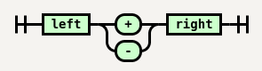

# GrammKit

GrammKit is a toll for generating syntax diagrams (also known as railroad diagrams) for parser grammars. Check out the [online version](http://dundalek.com/GrammKit/).

Currently two grammar formats are supported:
- [PEG.js](http://pegjs.org) - it is parsed into internal AST of PEG.js which is then translated using [peg-rd.js](./lib/peg-rd.js).
- [EBNF](http://www.w3.org/TR/2004/REC-xml11-20040204/#sec-notation) defined in W3C standards - it parsed into AST using [parse-ebnf.pegjs](./lib/parse-ebnf.pegjs)

Is uses the [railroad-diagrams](https://github.com/tabatkins/railroad-diagrams) library to generate SVG images.

## Use the library

`npm install grammkit`

```javascript
var grammkit = require('grammkit');
var parse = require('pegjs/lib/parser').parse;

var grammar = parse('start = left ("+" / "-") right');
grammkit.diagram(grammar.rules[0]);
// => '<svg>...</svg>'

```

The SVG renders as:


