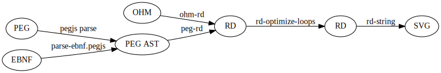

# GrammKit

GrammKit is a tool for generating syntax diagrams (also known as railroad diagrams) for parser grammars. Check out the [online version](http://dundalek.com/GrammKit/).

Currently these grammar formats are supported:
- [PEG.js](http://pegjs.org) - it is parsed into internal AST of PEG.js which is then translated using [peg-rd.js](./lib/peg-rd.js).
- [EBNF](http://www.w3.org/TR/2004/REC-xml11-20040204/#sec-notation) defined in W3C standards - it parsed into AST using [parse-ebnf.pegjs](./lib/parse-ebnf.pegjs)
- [Ohm](https://github.com/harc/ohm) - translation is done using semantic actions in [ohm-rd.js](./lib/ohm-rd.js)

Is uses the [railroad-diagrams](https://github.com/tabatkins/railroad-diagrams) library to generate SVG images.

## Use the command line utility

`npm install -g grammkit`

To generate static html page run `grammkit yourgrammar.peg`.

To generate markdown file run `grammkit -t md yourgrammar.peg`.
This will generate separate SVG files and a markdown file that includes them.

## Use the library

`npm install grammkit`

```javascript
var grammkit = require('grammkit');
var parse = require('pegjs/lib/parser').parse;

var grammar = parse('start = left ("+" / "-") right');
grammkit.diagram(grammar.rules[0]);
// => '<svg>...</svg>'

```

The SVG renders as:


## Development

Clone repo and install dependencies with `npm install`.

Run `npm run dev` and open browser at http://localhost:3000/dist/ .

Here is an overview how the format conversion works:



## Changelog

### v0.6.3

- Fix onclick events for SVG elements ([#13](https://github.com/dundalek/GrammKit/pull/13))

### v0.6.2

- Bump dependencies to satisfy npm audit

### v0.6.1

- Update ohm dependency

### v0.6.0

- Add support for ohm grammars
- Choose different formats in web app and cli

## Related projects

List of other project worth checking out.

- [jison debugger](http://nolanlawson.github.io/jison-debugger/) - interesting visualization of a parse tree for jison grammars
- [ohm interactive editor](https://ohmlang.github.io/editor/) - online editor for ohm grammars that also visualizes parse tree
